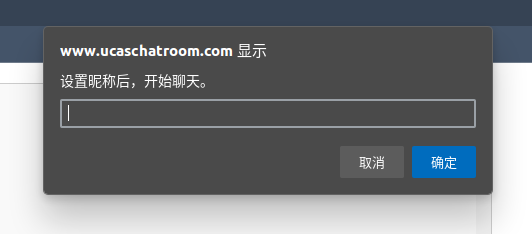

# ucas_chatroom


可以从云盘[下载成品镜像](https://pan.baidu.com/s/1VJI1EFsSPE_uxcENzdFEdg?pwd=6wy6)(提取码: 6wy6)，可以省去环境配置和软件安装、代码部署的步骤。
> 虚拟机实例中的用户名及密码：
> 
> ucasuser/123456
> 
> root/Abc123!
> 
> 注：由于虚拟机打包时部署有一份测试代码，随着代码更新已经过时，使用时请从github中同步最新的代码到虚拟机中使用。

# 操作系统与运行环境
* [CentOS-7](https://mirrors.tuna.tsinghua.edu.cn/centos/7.9.2009/isos/x86_64/CentOS-7-x86_64-Everything-2009.iso)
* [VirtualBox 7.0](https://www.virtualbox.org/wiki/Downloads)
* [php7.4.33](https://www.php.net/distributions/php-7.4.33.tar.gz)
* [swoole4.8.11](https://wenda-1252906962.file.myqcloud.com/dist/v4.8.11/swoole-src-4.8.11.tar.gz)
* [nginx1.25.2](https://nginx.org/download/nginx-1.25.2.tar.gz)

# 环境配置和软件安装

## 安装 VirtualBox
使用上面提供的链接下载VirtualBox7.0并安装，然后在“File->Tools->Network Manager”里，新建一个Host-only Networks和NAT Networks；
## 安装CentOS7操作系统虚拟机
1. 在VirtualBox主界面单击“New“按钮，创建一个新的虚拟机；
2. ISO Image选择通过上方给出的链接下载的 CentOS7 iso 系统镜像；
3. 在后续的设置中，设置虚拟机的 cpu 核数不少于 2，内存不少于 2G，硬盘空间不少于 20G；
4. 安装过程中创建用户 *ucasuser* 并设置密码，同时也创建一个 root 密码。
## 安装软件

1. 切换到 *root* 用户，执行下述命令，执行结束后切换回 *ucasuser* 用户：
```
yum -y install gcc gcc-c++ openssl-devel
yum install libxml2 libxml2-devel sqlite-devel.x86_64 httpd-devel
yum install autoconf wget git
firewall-cmd --zone=public --add-port=80/tcp --permanent 
firewall-cmd --reload 
```

2. 创建目录结构
```
mkdir /home/ucasuser/downloads
mkdir /home/ucasuser/apps
mkdir -p /home/ucasuser/www/ucaschat
```

3. 下载资源并解压
```
cd /home/ucasuser/downloads
wget https://www.php.net/distributions/php-7.4.33.tar.gz
wget https://nginx.org/download/nginx-1.25.2.tar.gz
wget https://wenda-1252906962.file.myqcloud.com/dist/v4.8.11/swoole-src-4.8.11.tar.gz
tar zxvf php-7.4.33.tar.gz
tar zxvf nginx-1.25.2.tar.gz
tar zxvf swoole-src-4.8.11.tar.gz
```

4. 安装php7.4 with swoole4.8
```
cp -r /home/ucasuser/downloads/swoole-src-4.8.11 /home/ucasuser/downloads/php-7.4.33/ext/swoole-src
cd /home/ucasuser/downloads/php-7.4.33
./buildconf --force
# 确认下 swoole 扩展是否在 php 源码中成功注册
./configure --help | grep swoole
./configure --prefix=/home/ucasuser/apps/php7 --enable-fpm --with-fpm-user=www --with-fpm-group=www --disable-rpath --enable-sysvsem --with-openssl --with-mhash --enable-pcntl --enable-sockets --without-pear --disable-fileinfo --enable-swoole
make
make install
```

5. nginx 安装
```
cd /home/ucasuser/downloads/nginx-1.25.2
./configure --prefix=/home/ucasuser/apps/nginx --with-pcre --with-stream --with-http_ssl_module --with-stream_ssl_module
make
make install
```

6. 安装结果验证
```
/home/ucasuser/apps/php7/bin/php -m | grep swoole
/home/ucasuser/apps/nginx/sbin/nginx -version
```
如果两个命令可以正常执行并正确返回所安装的 swoole 模块名称和 nginx 的版本信息，则表示安装成功。

7. 软件配置
```
vim /home/ucasuser/apps/nginx/conf/nginx.conf
```
在最后一个}之前添加一行：
```
    include /home/ucasuser/apps/nginx/conf/vhost/*.conf;
```
然后执行：
```
mkdir /home/ucasuser/apps/nginx/conf/vhost
vim chatroom.conf
```
编辑*chatroom.conf*的内容如下：
```
upstream www.ucaschatroom.com {
    server 127.0.0.1:80;
    keepalive 2000;
}

upstream socket.ucaschatroom.com {
    hash $remote_addr consistent;
    server 127.0.0.1:20230;
}
server {
        listen 80;
        server_name   www.ucaschatroom.com;

        location / {
                # proxy_pass http://www.ucaschatroom.com/;
                # proxy_set_header Host $host:$server_port;
                root /home/ucasuser/www/ucaschat;
                index index.html;
        }
}

server {
        listen 80;
        server_name   socket.ucaschatroom.com;

        location / {
                proxy_pass http://socket.ucaschatroom.com/;
                proxy_set_header Host $host:$server_port;
                proxy_http_version 1.1;
                proxy_set_header Upgrade $http_upgrade;
                proxy_set_header Connection "upgrade";
        }
}
```


# 代码部署与服务启动
1. 从 github 下载 [LeetJoe/ucas_chatroom](https://github.com/LeetJoe/ucas_chatroom) 项目源代码，并将解压后的内容部署到 /home/ucasuser/www/ucaschat；
2. 执行下面的代码启动服务
```
/home/ucasuser/apps/php7/bin/php /home/ucasuser/www/ucaschat/chat_server.php
# switch to root
/home/ucasuser/apps/nginx/sbin/nginx
```


# 服务管理与运行监控
```
# 查看正在运行的服务进程
ps aux | grep php | grep chat_server
# 终止所有运行的服务进程
ps aux | grep php | grep chat_server | awk '{print $2}' | xargs kill -9

# 查看运行日志
tail -f /home/ucasuser/www/ucaschat/log/chat.log
```

# 功能验证
在进行测试的客户端主机上添加下面的路由项：
```
192.168.56.102 www.ucaschatroom.com
192.168.56.102 socket.ucaschatroom.com
```
其中前面的*192.168.56.102*是通过客户机可访问的虚拟机（作为服务器）的IP地址，需要根据自己本地网络的实际情况进行修改。
在两台不同的机器或者同一台机器上两个不同的浏览器窗口进行测试，给自己起一个昵称，就可以开始聊天了。


### 首先设置一个昵称


### 小王视角


### 小红视角


